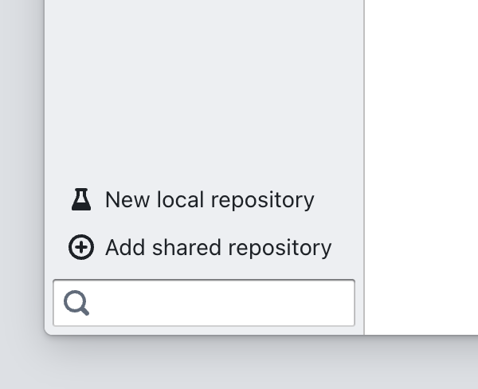
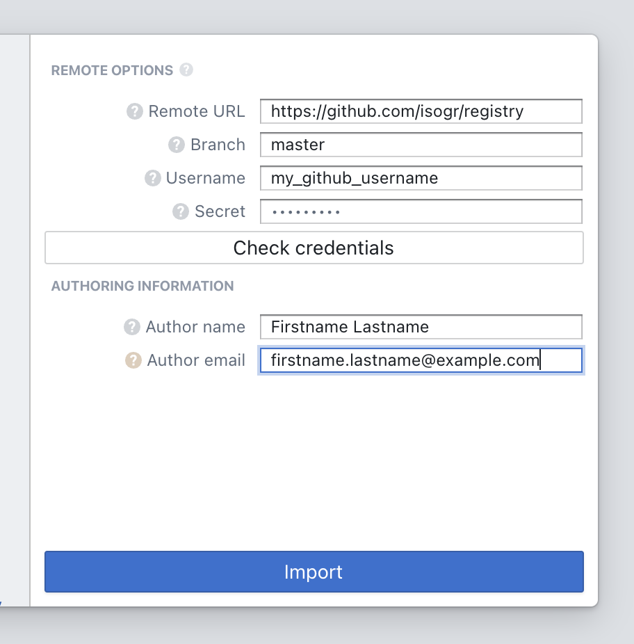
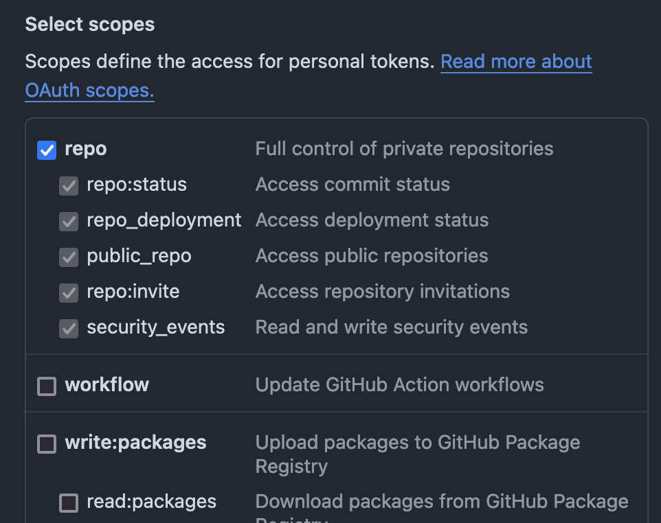

= HOWTO: Add Repository to Paneron

This document describes how to add a new repo to Paneron.

== Steps

=== Adding the repo to Paneron

. Open Paneron.
. Click on "Add shared repository" on the left side bar.
+

. On the right, fill in the fields.
+

+
.. *Remote URL*: Input the URL of the repo.
   _E.g._, `https://github.com/isogr/registry`
.. *Branch*
... As of now, if adding `isogr/registry` and the likes, input `master`.
.. *Username*: Input your GitHub user name if the URL is at `github.com`.
.. *Secret*: Leave it blank, unless your GitHub Personal Access Token is expired.
   Paneron caches your token if you have entered it previously and if it
   granted Paneron access to one of your GitHub repos.
   If expired, input your GitHub Personal Access Token.
.. *Author name*: This will appear in the repository in the commit history.
.. *Author email*: This will appear in the repository in the commit history.
. Click on "Check credentials" button.
.. It should say something like "Write access".
. Click on "Import" button.
. Find the added repo on the left side bar.
. Done.

=== (Re-)creating GitHub Personal Access Token

Sometimes, it is necessary to re-create your GitHub Personal Access Token.

It can happen if your GitHub Personal Access Token has expired, or if you
are setting up a new computer but have lost access to the token created before.

// . Follow the instructions in the https://docs.github.com/en/authentication/keeping-your-account-and-data-secure/managing-your-personal-access-tokens#creating-a-fine-grained-personal-access-token[GitHub docs on creating fine-grained Personal Access Token^].
. Follow the instructions in the https://docs.github.com/en/authentication/keeping-your-account-and-data-secure/managing-your-personal-access-tokens#creating-a-personal-access-token-classic[GitHub docs on creating Personal Access Token (classic)^].
.. For "scopes", make sure to check the "repo" category.
+

