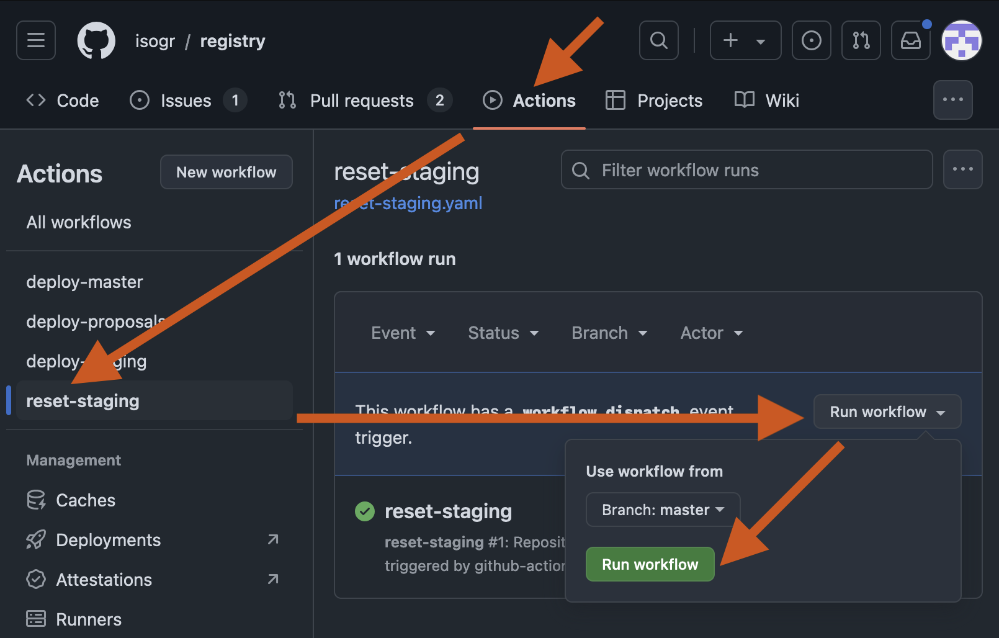
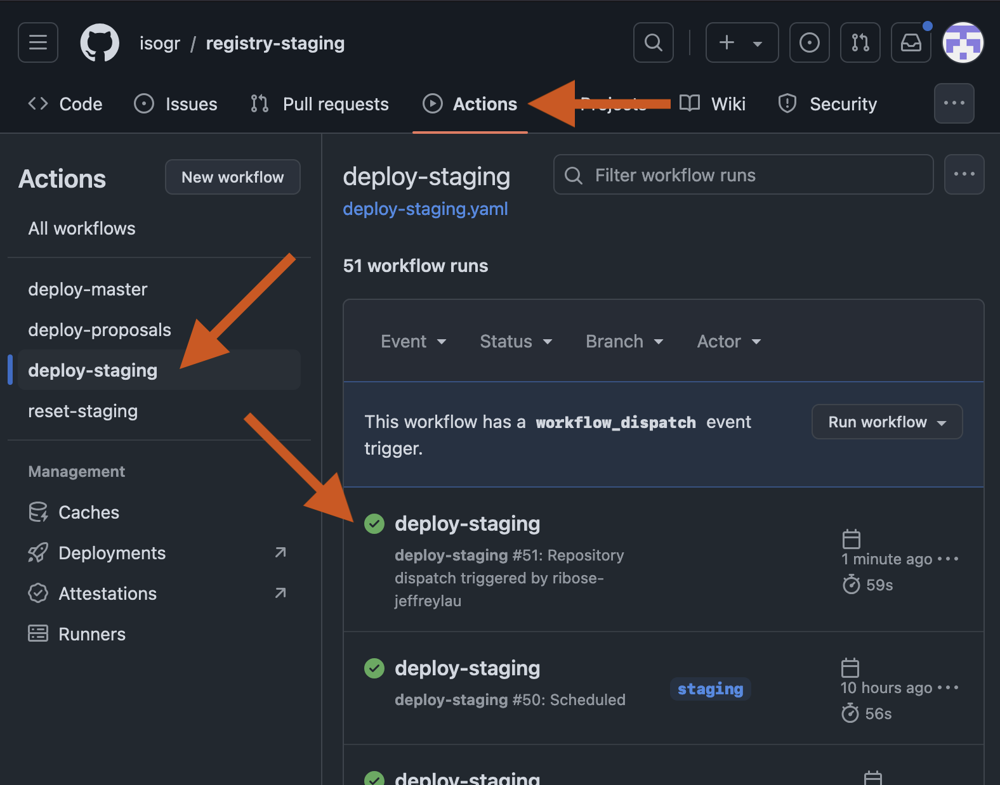

= HOWTO: Sync Staging Instance

This document describes how to reset staging instance to the same state as production.

== Steps

=== Initiating the sync

. Log in to https://github.com[^]
. [[:space:]]
.. Head to https://github.com/isogr/registry/actions/workflows/reset-staging.yaml[^]
.. [[:space:]]
... Or, head to https://github.com/isogr/registry[^],
... click on "Actions" at the top
... click on "reset-staging" on the left side bar
+
. Click on the "Run workflow" drop down button on the right
+

. See a small menu pop up that has the "branch" set to "master"
. On the pop up, click on "Run workflow" button
. Head to https://github.com/isogr/registry/actions/workflows/reset-staging.yaml[^]
   again (or refresh), wait a while (takes about 40 seconds), and see if the
   "reset-staging" workflow succeeds by showing a green tick
. Done

=== Verifying the sync is taking place

. Log in to https://github.com[^]
. [[:space:]]
.. Head to https://github.com/isogr/registry-staging/actions/workflows/deploy-staging.yaml[^]
.. [[:space:]]
... Or, head to https://github.com/isogr/registry-staging[^],
... click on "Actions" at the top
... click on "deploy-staging" on the left side bar
+

. See that "deploy-staging" workflow succeeds by showing a green tick
. Head to https://geodetic-staging.isotc211.org/[^] to see that it has reset to
  the same state as production
. Done
